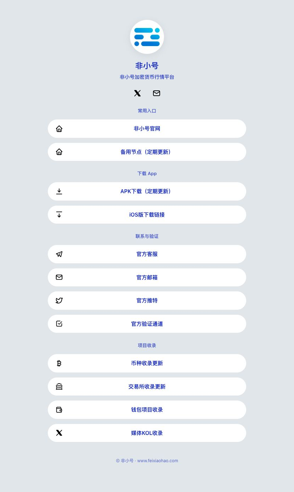

# 非小号 · 服务导航

加密货币行情与服务入口导航。此仓库由 FXH-feixiaohao 组织独立管理。

## 页面预览

## 内容

- 常用入口：官网、备用地址
- 下载 App：Android、iOS
- 联系与验证：Telegram、邮箱、X、官方验证
- 项目收录：币种、交易所、钱包、媒体 / KOL

## 隔离范围

独立仓库与提交历史，单独维护导航页面和素材。

## 本地查看

直接打开 `index.html`，或在项目目录运行 `python3 -m http.server 8765 --bind 127.0.0.1` 后访问 http://127.0.0.1:8765。

## 来源与维护

基于用户提供的 linktree-main.zip 整理，保留原头像、图标及目标链接。链接尚未逐一验证，需手动维护；没有自动更新机制。当前未启用公开网站托管。
